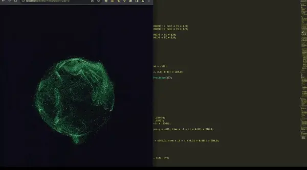

# 3D Sphere Sync

Yet another take on that infamous "junior dev test task" — the multi-window Three.js
thing that quietly tells you you're not getting the offer. Open the page in a couple of
browser windows and the glowing spheres inside them notice each other, line up across the
screen, and their surfaces stretch together where the windows meet.



*The original meme — this project reproduces the look shown above.*

## Overview

3D Sphere Sync is a multi-window particle visualization built with Three.js. Each browser
window renders a glowing sphere; when several windows are open on the same machine, the
spheres share their on-screen positions and their surfaces merge where the windows are
close. All coordination happens on the client through `localStorage` — there is no server
and no build step.

## Requirements

- A WebGL-capable browser (Chrome, Edge, Firefox, or Safari 14+).
- A local HTTP server. The page cannot be opened directly from `file://`: it loads ES
  modules through an importmap, and browsers block module loading over the `file://`
  protocol.

## Running locally

Serve the project directory over HTTP with any static server, for example:

```bash
# Python (bundled with most systems)
python -m http.server 8000

# Node.js
npx http-server .
```

Then open http://localhost:8000. In VS Code, the Live Server extension ("Go Live") is an
equivalent alternative.

## Reproducing the effect

A single window shows one sphere. The synchronization becomes visible with two or more
windows:

1. Open the page.
2. Open the same URL in a **separate operating-system window** (not a browser tab).
3. Arrange the windows side by side and move or resize them.

As the windows approach each other, each sphere's surface stretches toward the other and
the two merge into a single form. Chrome or Firefox with hardware acceleration enabled
produce the smoothest animation.

## How it works

Every window renders the same scene. Spheres are positioned in screen coordinates — an
orthographic camera maps one world unit to one pixel — so a sphere belonging to another
window appears at the same physical location in every window, creating the impression of a
single space spanning the monitors.

Each sphere consists of three particle layers:

- **Outer and inner membranes** — dense point clouds (~75,000 and ~28,000 points) rendered
  with a custom shader that displaces them using 3D simplex noise. The noise produces the
  folded-cloth texture, the flame-like protrusions, and the bright silhouette rim.
- **Core** — a small, soft central glow.

The link between two spheres is not a separate object. When a neighbour is nearby, the
membrane shader stretches a sphere's own points into a tapering funnel directed at the
partner, so the connection is formed from each sphere's own surface and keeps its own
colour instead of blending.

Colours (mint green `#63ffa6` and crimson `#ff2a64`) are sampled from the reference
footage and alternate per window.

## Project structure

```
index.html   # Canvas and the Three.js importmap
main.js      # Window synchronization, particle shaders, and the render loop
```

## Technology

Three.js 0.160 (WebGL), `EffectComposer` with `UnrealBloomPass` for the bloom effect, ES
modules via importmap, and `localStorage` for cross-window communication. No dependencies
require installation.

## License

MIT
